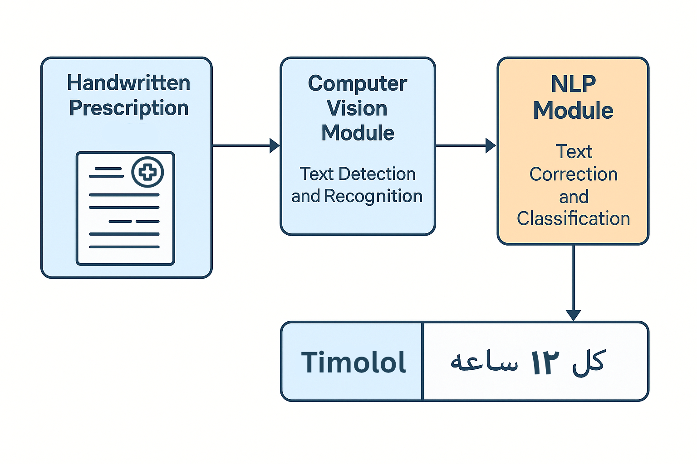

# Handwritten Prescription OCR

This project is a bilingual Optical Character Recognition (OCR) system designed to process handwritten medical prescriptions in Arabic and English. It combines advanced computer vision techniques for text detection and recognition with a natural language processing (NLP) module for text correction and classification. The system outputs a structured list of key-value pairs, where each pair consists of a medicine name and its corresponding prescription instruction.

## Table of Contents 📃

- [Overview](#overview)
- [Installation](#installation)
- [Usage](#usage)
- [Computer Vision Module](#computer-vision-module)
- [NLP Module](#nlp-module)
- [Models](#models)
- [Database](#database)
- [Output Format](#output-format)
- [Limitations](#limitations)
- [Acknowledgments](#acknowledgments)
- [License](#license)

## Overview 👀

The Handwritten Prescription OCR system is tailored for interpreting handwritten prescriptions, a challenging task due to the variability in handwriting styles and the bilingual nature of the text (Arabic and English). It employs a two-stage pipeline:

1. **Computer Vision Module**: Detects and recognizes text from prescription images.
2. **NLP Module**: Corrects and classifies the extracted text to produce meaningful medicine-prescription pairs.

The final output is a list of tuples, each containing a medicine name and its associated instruction, suitable for integration into pharmacy management systems or electronic health records.

## Installation 🚀

To set up the project, follow these steps:

1. **Install Dependencies**:
   ```bash
   pip install ultralytics transformers huggingface_hub symspellpy gdown
   ```

2. **Download the Database**:
   - The project requires a database of medicine names. Download it from [this Google Drive link](https://drive.google.com/uc?id=1iKhMK4R6HP3kq3v4pLONPXArtVYAPn2D) or provide your own Excel file named `database.xlsx`.

3. **Set Up Hugging Face Token**:
   - Obtain a token from [Hugging Face](https://huggingface.co/settings/tokens) to access the models. Replace the hardcoded token in the code with your own or set it as an environment variable.

## Usage 💻

To process prescription images, use the `submit` function with a list of image paths:

```python
images = ["path/to/prescription1.jpg", "path/to/prescription2.jpg"]
results = submit(images)
for result in results:
    print(result)
```

This will output a list of (medicine, prescription) pairs for each image. The system expects JPEG images and performs best with clear, legible handwriting.

## Computer Vision Module 1️⃣

The computer vision module handles text detection and recognition in two steps:

- **Text Detection**:
  - Utilizes the YOLO (You Only Look Once) model to identify text regions within the prescription image.
  - Images are resized to 640x640 pixels with padding, and YOLO predicts bounding boxes for text areas with a confidence threshold of 0.5 and an IoU threshold of 0.6.
  - Bounding boxes are sorted by their y-coordinate to maintain the reading order.

- **Text Recognition**:
  - Each detected text region is cropped, padded to 384x384 pixels, and processed by the TrOCR (Transformer-based Optical Character Recognition) model.
  - TrOCR converts the cropped image regions into readable text, which is then concatenated into a single string per image.

This module leverages GPU acceleration if available, enhancing performance for real-time applications.

## NLP Module 2️⃣

The NLP module processes the extracted text to ensure accuracy and structure:

- **Text Preprocessing**:
  - Handles bilingual text by converting English numbers between Arabic words into Arabic numerals (e.g., "كل 8 ساعات" becomes "كل ٨ ساعات").
  - Removes Arabic characters from mixed words unless they are entirely Arabic.

- **Spell Correction**:
  - Uses SymSpell, an edit distance-based spell checker, to correct misspelled words based on a dictionary derived from the medicine database.
  - Applies a maximum edit distance of 2 for corrections.

- **Classification and Pairing**:
  - Classifies words as medicines or instructions using the provided database.
  - Groups consecutive words of the same type and pairs each medicine with its subsequent instruction, ensuring medicine names appear first in the output pairs.

This module enhances the reliability of the extracted text, addressing common handwriting errors and linguistic nuances.

## Models 🤗

The project uses pre-trained models from Hugging Face:

- **Text Detection**:
  - YOLO: [wahdan2003/YOLO_handwritten_medical](https://huggingface.co/wahdan2003/YOLO_handwritten_medical)

- **Text Recognition**:
  - TrOCR (Primary Recognition Module): [David-Magdy/TROCR_MASTER_V2](https://huggingface.co/David-Magdy/TROCR_MASTER_V2) with processor from [microsoft/trocr-base-handwritten](https://huggingface.co/microsoft/trocr-base-handwritten)
  - TrOCR (Prescription Data): [David-Magdy/TROCR_LARGE_PRESCRIPTION_DATA](https://huggingface.co/David-Magdy/TROCR_LARGE_PRESCRIPTION_DATA)
  - TrOCR (Base Model Fine-Tuned On Khatt and I_am Datasets): [David-Magdy/TR_OCR_LARGE](https://huggingface.co/David-Magdy/TR_OCR_LARGE)


## Database 📚

The system relies on an Excel file (`database.xlsx`) containing medicine names and their classifications. You can replace it with your own database by modifying the `drug_file` path in the code. Ensure the file includes a `text` column for medicine names and a `medicine` column for classification (1 for medicines, 0 for instructions).

## Output Format 📄

The output is a list of tuples per image, where each tuple contains a medicine name (key) and its prescription instruction (value). Example:

```python
[('Mupirocin', 'كل ١٢ ساعه'), ('باراسيتامول', 'قبل الفطار'), ('Hydrocortisone', 'مرتين يوميا')]
```

This structured format facilitates downstream applications like automated dispensing or record-keeping.

## Limitations 🧱

- Optimized for handwritten prescriptions; performance may degrade with printed text.
- Accuracy depends on handwriting legibility and image quality.
- Requires a comprehensive medicine database for effective classification.
- Supports only Arabic and English; additional languages need further adaptation.

## Acknowledgments
This Project won [3rd place 🥉](https://media.licdn.com/dms/image/v2/D4D22AQG7sAQ7g6Q3Kw/feedshare-shrink_2048_1536/B4DZbOJFshG8As-/0/1747215364441?e=1755734400&v=beta&t=HKIKBO8XOjiu7ocLZbsVJtw0NO6HUmJfjAScEuNzzDg) among 20+ teams in STP (Step Toward Progress) Machathon 6.00.
- Developed By [Ahmed Wahdan](https://github.com/Ahmedwahdan2003) and Me.

## License ⚓

This project is licensed under the MIT License.
